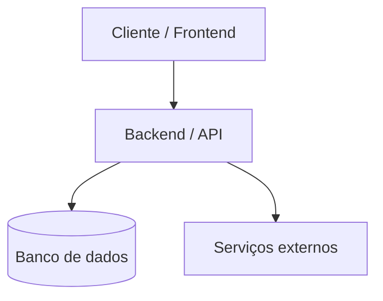

# {{PROJECT_NAME}} — Plano Técnico

> {{PROJECT_TAGLINE}}

> Gerado a partir do template `skink` em {{DATE}} pela skill `project-bootstrap`. Mantenha este documento atualizado conforme decisões de arquitetura mudarem — ele é a fonte da verdade sobre "por que escolhemos X e não Y", não só o `README.md`.

---

## 1. Contexto e objetivo

**O que este projeto resolve:** {{PROJECT_TAGLINE}}

**Tipo de projeto:** {{PROJECT_TYPE}}

**Requisitos funcionais principais:**

<!-- Liste 3-6 requisitos funcionais concretos levantados na entrevista de bootstrap. -->

- {{REQUIREMENT_1}}
- {{REQUIREMENT_2}}

**Requisitos não funcionais:**

<!-- Ex.: performance esperada, disponibilidade, latência, volume de dados/usuários. -->

- Escala esperada: {{SCALE}}
- {{NON_FUNCTIONAL_1}}

---

## 2. Decisões de arquitetura (com trade-offs)

<!-- Cole aqui a(s) tabela(s) comparativa(s) produzida(s) pela skill stack-selector durante a entrevista,
     uma por decisão relevante (linguagem/framework, banco de dados, frontend, etc.). Formato: -->

### 2.1 {{DECISION_TOPIC_1}}

| Critério | Opção A | Opção B | Opção C |
|---|---|---|---|
| ... | ... | ... | ... |

**Decisão:** {{DECISION_1}}. **Motivo:** {{DECISION_1_REASON}}

### 2.2 Stack escolhida (resumo)

{{STACK_SUMMARY}}

---

## 3. Arquitetura geral

<!-- Substituir pelo diagrama real do projeto. Exemplo de esqueleto: -->



---

## 4. Alocação de rede, portas e domínios

<!-- Só relevante se o deploy for VPS próprio ou houver múltiplos serviços no mesmo host.
     Remover esta seção se o deploy for PaaS/serverless totalmente gerenciado. -->

| Recurso | Valor | Observação |
|---|---|---|
| Domínio | {{DOMAIN}} | |
| Porta interna do backend | {{BACKEND_PORT}} | Nunca exposta direto — sempre via proxy |
| Banco de dados | {{DB_PORT}} | {{DB_BIND_NOTE}} |

**Alvo de deploy:** {{DEPLOY_TARGET}} (ver skill `deploy-setup` para o que isso implica em CI/CD).

---

## 5. Especificação dos componentes

<!-- Uma subseção por componente principal (backend, frontend, worker, CLI, etc.).
     Referencie os arquivos/pastas reais gerados pela skill dev-environment-setup. -->

### 5.1 {{COMPONENT_1_NAME}}

- Stack: {{COMPONENT_1_STACK}}
- Responsabilidade: {{COMPONENT_1_RESPONSIBILITY}}

---

## 6. Segurança

Requisitos especiais levantados na entrevista: {{SECURITY_REQUIREMENTS}}

Ver `SECURITY.md` para o modelo de ameaças completo e garantias de design.

---

## 7. Riscos, limitações e mitigações

| Risco | Impacto | Mitigação |
|---|---|---|
| {{RISK_1}} | {{RISK_1_IMPACT}} | {{RISK_1_MITIGATION}} |

---

## 8. Estrutura de diretórios

```
{{PROJECT_NAME}}/
├── PLAN.md
├── ROADMAP.md
├── README.md
├── AGENTS.md
├── CONTRIBUTING.md
├── SECURITY.md
├── CHANGELOG.md
├── .cursor/
├── tasks/
└── {{SOURCE_DIRS}}
```

### 8.1 Convenção de build e artefatos

Regra geral: **código-fonte é commitado, artefato de build nunca é.** Ver `.gitignore` e o `Makefile` (targets `build`/`dist`) para onde cada artefato é gerado.

---

## 9. Roadmap

Ver `ROADMAP.md` para o checklist de execução por fases — mantenha os dois documentos sincronizados: decisões que mudam aqui devem refletir lá, e vice-versa.

---

## 10. Próximos passos imediatos

1. {{NEXT_STEP_1}}
2. {{NEXT_STEP_2}}
