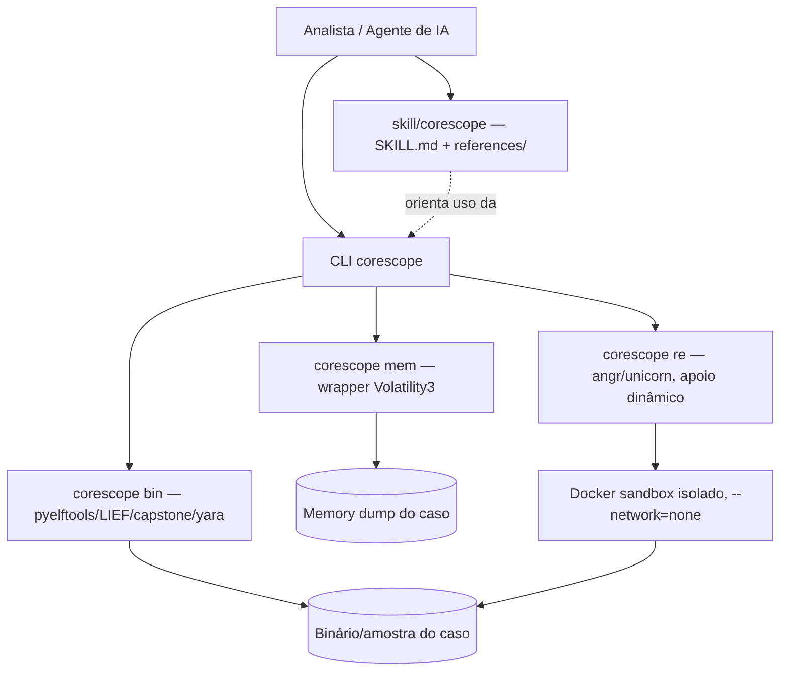

# corescope — Plano Técnico

> Agent Skill + toolkit em Python 3 para forense de memória, análise estática de binários e engenharia reversa — nunca "responde de memória", sempre verifica na amostra/dump real e cita o comando/endereço que sustenta a afirmação.

> Gerado a partir do template `skink` em 2026-08-13 pela skill `project-bootstrap`. Mantenha este documento atualizado conforme decisões de arquitetura mudarem — ele é a fonte da verdade sobre "por que escolhemos X e não Y", não só o `README.md`.

---

## 1. Contexto e objetivo

**O que este projeto resolve:** analistas de segurança e praticantes de engenharia reversa acabam recriando, a cada investigação, os mesmos scripts de triagem (memória, binário, IOCs) e re-explicando ao assistente de IA os mesmos comandos/armadilhas. O `corescope` empacota isso uma vez: uma **Cursor/Claude Agent Skill** com conhecimento validado e hierarquizado por confiança, apoiada por uma **CLI Python 3** fina sobre ferramentas já estabelecidas da área.

**Tipo de projeto:** biblioteca/CLI + pacote de Agent Skill (conhecimento estruturado para IA), Python 3.

**Inspiração de metodologia:** [`fs25-claude-skill`](https://github.com/TheCodingDad-TisonK/fs25-claude-skill) — generalizamos o padrão dele (fontes hierarquizadas por confiança, `references/` por domínio, arquivo de pitfalls com selo de validação, empacotamento em `.skill`) para o domínio de forense/RE, que não tem um único corpus fixo para decompilar (cada investigação tem sua própria amostra).

**Requisitos funcionais principais:**

- Skill Cursor/Claude (`skill/corescope/SKILL.md`) cobrindo forense de memória, análise estática de binários e engenharia reversa, com tabela de precedência de fontes (rodar a ferramenta agora > padrão validado bundled > documentação oficial via WebFetch).
- CLI Python (`corescope`) com subcomandos de triagem: `corescope mem` (memória/Volatility3), `corescope bin` (binário estático ELF/PE), `corescope re` (apoio a engenharia reversa: strings/IOCs/YARA/detecção de packer).
- Biblioteca de padrões validados (`references/patterns/`) e armadilhas conhecidas (`references/pitfalls/what-doesnt-work.md`) por domínio, com selo de validação (✅/⚠️/📚).
- Ambiente de análise dinâmica isolado (`Dockerfile` sandbox, sem rede por padrão) para qualquer binário não confiável — nunca rodar amostra direto no host.
- Empacotamento da skill como `.skill` (zip via `skill/package_skill.py`) distribuído nas GitHub Releases, ao lado do pacote Python (`pip`/wheel).
- Guardrails éticos/legais embutidos na skill e no README: só analisar amostras/sistemas que o usuário possui ou está expressamente autorizado a examinar; nunca ajudar a produzir malware funcional para uso não autorizado.

**Requisitos não funcionais:**

- Escala esperada: ferramenta pessoal/pequena comunidade de segurança, publicada abertamente no GitHub (`rootkit-lab/corescope`, público) — não é um serviço com SLA.
- Sem servidor em produção: é uma ferramenta local + skill de IA; "deploy" = release no GitHub (pacote `pip` + `.skill`).
- Multiplataforma nas amostras analisadas (ELF/Linux e PE/Windows), execução da própria CLI em Linux/macOS (Windows via WSL é aceitável, não prioritário).
- Python 3.10+.

---

## 2. Decisões de arquitetura (com trade-offs)

### 2.1 Formato do pacote de conhecimento (skill)

| Critério | Skill única com `references/` por domínio | Múltiplas skills separadas (memória / binário / RE) | Sem skill, só docs soltos |
|---|---|---|---|
| Descoberta pelo agente | Uma descrição cobre os 3 domínios, agente só precisa achar 1 skill | Agente precisa escolher a skill certa a cada pergunta | Nenhuma injeção automática de contexto |
| Empacotamento/distribuição | 1 arquivo `.skill` | N arquivos `.skill` (mais fricção de instalar) | N/A |
| Reuso de padrão (fs25-claude-skill) | Igual ao que o repo de referência faz | Diverge do padrão de referência | Diverge |
| Manutenção | 1 `SKILL.md` + `references/` cresce por domínio | 1 `SKILL.md` por domínio, mais duplicação de boilerplate | Sem estrutura |

**Decisão:** skill única (`skill/corescope/SKILL.md`) com `references/memory-forensics/`, `references/binary-analysis/`, `references/reverse-engineering/`, `references/patterns/`, `references/pitfalls/`, `references/tool-index/`. **Motivo:** os três domínios compartilham o mesmo usuário/fluxo de investigação (uma triagem real costuma tocar memória *e* binário *e* RE na mesma sessão) e é exatamente o padrão validado pelo `fs25-claude-skill`.

### 2.2 Stack escolhida (resumo)

- **Linguagem:** Python 3.12 (mínimo 3.10), gerenciado via `venv` + `pip` (consistente com o preset `python` do skink).
- **Lint/format:** `ruff`. **Testes:** `pytest`.
- **Forense de memória:** [`volatility3`](https://github.com/volatilityfoundation/volatility3) — framework padrão da indústria, Python 3 nativo.
- **Análise de binário estático:** `pyelftools` (ELF), `pefile` (PE), `LIEF` (parsing multi-formato), `capstone` (desmontagem), `yara-python` (regras/IOCs).
- **Engenharia reversa/dinâmica:** `angr` (execução simbólica, opcional/pesado), `unicorn` (emulação), documentação de uso do Ghidra/radare2 via CLI (não são dependências Python, são ferramentas externas orquestradas).
- **Empacotamento:** `pyproject.toml` + `build` (wheel/sdist) para a CLI; `skill/package_skill.py` (zip) para a skill.
- Dependências pesadas (`volatility3`, `angr`) ficam em **extras opcionais** (`pip install corescope[memory]`, `corescope[re]`) — o core (CLI + skill) instala rápido sem elas.

---

## 3. Arquitetura geral



Não há backend/API em produção — todo processamento é local, por invocação da CLI ou por leitura de `references/` pelo agente de IA.

---

## 4. Alocação de rede, portas e domínios

Não aplicável — não há serviço de rede em produção. Distribuição via GitHub Releases (pacote `pip`/wheel + `.skill`).

**Alvo de "deploy":** GitHub Releases (sem servidor) — ver skill `deploy-setup` (adaptada: CI roda `make verify`; "release" publica os artefatos, não faz deploy de serviço).

---

## 5. Especificação dos componentes

### 5.1 CLI (`src/corescope/cli.py`)

- Stack: Python 3, `argparse`, subcomandos `mem`/`bin`/`re`.
- Responsabilidade: parsing de argumentos, carregar caso (diretório de trabalho), delegar para os módulos de análise, nunca conter lógica de negócio no parser.

### 5.2 Módulos de análise (`src/corescope/memory/`, `src/corescope/binary/`)

- Stack: wrappers finos sobre Volatility3/pyelftools/LIEF/capstone/yara-python.
- Responsabilidade: cada função retorna dados estruturados (dict/dataclass) + a evidência bruta (comando executado, offset/endereço) — nunca uma conclusão sem a evidência que a sustenta.

### 5.3 Skill (`skill/corescope/`)

- Stack: Markdown (`SKILL.md` + `references/*.md`), sem código.
- Responsabilidade: ensinar o agente de IA a investigar (rotear a pergunta para a referência certa, hierarquia de fontes, pitfalls conhecidos) e a usar a CLI acima.

### 5.4 Sandbox de análise dinâmica (`Dockerfile`)

- Stack: `python:3.12-slim` + ferramental de análise (binutils, file, yara), sem `EXPOSE` de porta.
- Responsabilidade: ambiente isolado e descartável para rodar/inspecionar qualquer binário não confiável. Uso padrão documentado com `--network=none` e volume read-only para a amostra.

---

## 6. Segurança

Requisitos especiais levantados na entrevista: domínio sensível por natureza (forense digital, análise de malware, engenharia reversa) — uso ético/autorizado é o requisito central, não conformidade regulatória específica (sem dados pessoais de terceiros processados pela ferramenta em si).

Ver `SECURITY.md` para o modelo de ameaças completo e garantias de design.

---

## 7. Riscos, limitações e mitigações

| Risco | Impacto | Mitigação |
|---|---|---|
| Uso indevido para produzir malware real/funcional | Alto (dano a terceiros, legal) | Escopo ético explícito em `SKILL.md`/`README.md`; recusa a pedidos de weaponização ou bypass não autorizado; a skill nunca gera payload funcional, só analisa |
| Rodar amostra desconhecida fora de isolamento | Alto (comprometimento do host do analista) | `Dockerfile` sandbox obrigatório para qualquer execução dinâmica; `references/pitfalls/` reforça isso |
| Falso positivo/negativo em heurística (packer, IOC, capability) | Médio (conclusão errada de investigação) | Toda afirmação cita o comando/endereço que a gerou; nunca inferir sem evidência local |
| Dependências pesadas (`volatility3`, `angr`) dificultam instalação do core | Baixo | Extras opcionais (`pip install corescope[memory]`/`[re]`); core mínimo instala sem elas |
| Amostra real/dump de memória commitado por engano no Git | Alto (exposição de dados sensíveis de terceiros) | `.gitignore` cobre `samples/`, `cases/`, `*.dmp`, `*.vmem`, `*.raw`; hook `pre-commit` + revisão manual antes de qualquer commit |

---

## 8. Estrutura de diretórios

```
corescope/
├── PLAN.md
├── ROADMAP.md
├── README.md
├── AGENTS.md
├── CONTRIBUTING.md
├── SECURITY.md
├── CHANGELOG.md
├── LICENSE
├── pyproject.toml
├── Makefile
├── Dockerfile              # sandbox de análise dinâmica, não "produção"
├── .cursor/
├── tasks/
├── src/corescope/          # CLI + módulos de análise
├── tests/
├── skill/corescope/        # SKILL.md + references/
└── releases/               # artefatos gerados (.skill, wheel) — gitignored
```

### 8.1 Convenção de build e artefatos

Regra geral: **código-fonte é commitado, artefato de build nunca é.** `releases/`, `dist/`, `build/`, `*.egg-info` são gitignored — ver `Makefile` (target `dist`) para como são gerados (wheel + `.skill`).

---

## 9. Roadmap

Ver `ROADMAP.md` para o checklist de execução por fases — mantenha os dois documentos sincronizados: decisões que mudam aqui devem refletir lá, e vice-versa.

---

## 10. Próximos passos imediatos

1. Ambiente de dev validado (`make install && make dev && make verify` limpos no esqueleto).
2. Primeira versão real da skill (`skill/corescope/SKILL.md` + `references/` + `scripts/`) numa branch `feat/`, com PR — não faz parte do commit de bootstrap.
3. Primeira release `v0.1.0` (wheel + `.skill`) depois que a Fase 2 do `ROADMAP.md` estiver completa.
